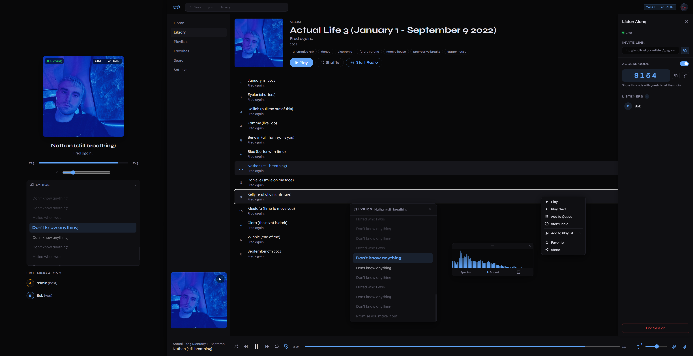

# Orb

Orb is a self-hosted, lossless music streaming platform - a personal Spotify backed by your own audio library. Stream FLAC, WAV, and other lossless formats at full fidelity to a modern web client. Multi-user, playlists, and queue support.

> Orb is in VERY early development, and is provided as-is for now.



## ✨ Features

- **Library Management:** Automatic indexing, metadata extraction, album art embedding
- **Streaming:** Lossless FLAC/WAV/MP3 at full bit depth (up to 32-bit/192kHz), HTTP range requests, client-side WASM decoding
- **User Management:** Multi-user, individual libraries, playlists, persistent queue
- **Discovery:** Advanced search, favorites, recently played
- **UI:** SvelteKit frontend with Melt UI + Tailwind, responsive layout

> Native Android & IOS apps are on the roadmap.

## 📦 Supported Platforms

Orb is distributed exclusively as Docker images for Linux, Windows, and macOS (amd64, arm64). There is no static binary; Orb only runs in Docker.

> Note: macOS builds may have limited codec support due to platform restrictions.

## 🚀 Quick Start

### Using Docker (Recommended)

```bash
docker compose -f docker-compose.local.yml up -d
```

## 🤝 Contributing

Contributions welcome! Report bugs, suggest features, or submit PRs.

## 📄 License

[MIT License](https://github.com/alexander-bruun/orb/blob/main/LICENSE)
