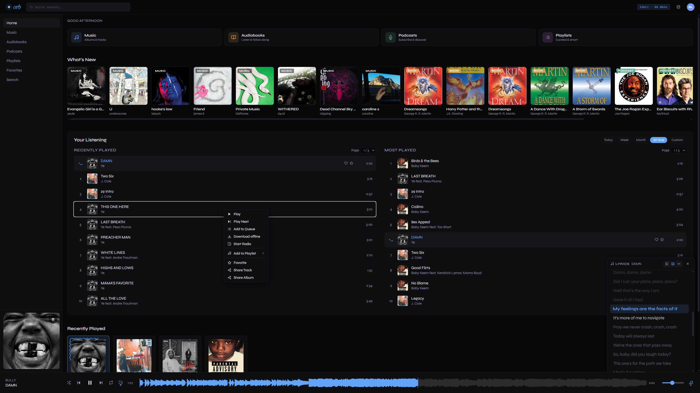

<div align="center">
  
  <p>Self-hosted, lossless music streaming. Your library, your server, full fidelity.</p>
  
  
  
  
</div>

---



---

## What is Orb?

Orb is a self-hosted music server built for audiophiles who want Spotify-level convenience without sacrificing audio quality or privacy. Point it at your library, spin up Docker, and stream FLAC, WAV, and other lossless formats at full bit depth from any browser — or install the native app on desktop and mobile.

## Features

- **Lossless streaming** — FLAC, WAV, AIFF, DSD, and SACD at up to 32-bit/192kHz and 7.1 surround sound
- **Library management** — Auto-indexing, MusicBrainz & Discogs metadata enrichment, and embedded album art
- **Audiobooks** — Support for chapter markers, variable playback speed, and bookmarking
- **Podcasts** — Subscribe, sync, and stream podcast episodes alongside your music library
- **Playlists** — Create, import, and export playlists per user
- **Discovery** — Search, favorites, recently played, similarity-based recommendations, and autoplay radio
- **Scrobbling** — Last.fm integration to track your listening history
- **Listen Along** — Share a real-time listening session with guests via a shareable link
- **Multi-user** — Individual libraries, queues, and settings per user
- **Native apps** — Desktop (Linux, macOS, Windows) and mobile (Android, iOS) via Tauri v2
- **PWA** — Installable from the browser on any device

## Quick Start

```bash
docker compose up -d
```

Then open `http://localhost:3000` in your browser.

See the [full documentation](https://alexander-bruun.github.io/orb/) for configuration, environment variables, and advanced setup.

## Contributing

Contributions are welcome. Open an issue to report a bug or suggest a feature, or submit a pull request directly.

## License

[MIT](LICENSE)
